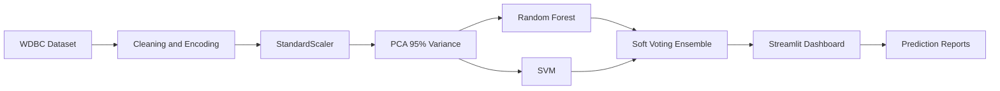

# Clinical Decision Support in Oncology

## Abstract
This project presents a clinical decision support system for early detection of malignant breast tumors using diagnostic imaging features from the Breast Cancer Wisconsin Diagnostic dataset. The system applies feature scaling, PCA dimensionality reduction, Random Forest, SVM, and a soft voting ensemble, with SHAP-based explainability and a Streamlit dashboard.

## Introduction
Breast cancer diagnosis benefits from accurate, interpretable machine learning systems that can assist clinicians during preliminary assessment. This application uses thirty numeric imaging-derived tumor features to classify tumors as malignant or benign.

## Problem Statement
Build a reliable oncology decision support system that predicts malignancy from real diagnostic imaging features and communicates model performance, patient-level risk, and explainability in a professional dashboard.

## Dataset Description
- Dataset: Breast Cancer Wisconsin Diagnostic (WDBC)
- Source: UCI Machine Learning Repository
- Samples: 569
- Features: 30 diagnostic imaging features
- Target: Malignant or Benign
- Encoding: Malignant = 1, Benign = 0

## Methodology
1. Load the WDBC dataset from UCI.
2. Clean data, remove duplicates, validate missing values, and encode diagnosis.
3. Explore class balance, correlations, histograms, pair plot, box plots, and feature importance.
4. Scale features with StandardScaler.
5. Apply PCA with `n_components=0.95`.
6. Train Random Forest and SVM classifiers.
7. Train a soft VotingClassifier ensemble.
8. Evaluate accuracy, precision, recall, F1, ROC AUC, sensitivity, and specificity.
9. Provide single-patient and batch CSV predictions with downloadable reports.
10. Provide SHAP explanations and downloadable reports.

## Architecture Diagram


## Installation Steps
```bash
cd Oncology_Decision_Support
python -m venv .venv
.venv\Scripts\activate
pip install -r requirements.txt
python -m src.train
streamlit run streamlit_app.py
```

## Screenshots Section
Add screenshots from the Home, EDA, PCA, Model Performance, Prediction, Explainable AI, and Reports pages after running the application.

## Results
The training pipeline automatically compares Random Forest, SVM, and Voting Ensemble models and stores the best-performing model metadata in `models/best_model.json`. Full metrics are stored in `reports/model_metrics.csv`.

## Batch Prediction
The Streamlit dashboard includes a Batch Prediction page for scoring multiple tumor records from a CSV file. Download the template from the page, fill in the 30 diagnostic feature columns, upload the CSV, run predictions, and download the scored results with prediction, confidence, malignant probability, and risk level.

## Future Scope
- Integrate more imaging modalities and external validation cohorts.
- Add hospital EHR integration with secure authentication.
- Implement model monitoring and drift detection.
- Add calibrated probability thresholds approved by clinical experts.
- Package the application in Docker for reproducible deployment.

## Run Command
```bash
streamlit run streamlit_app.py
```
